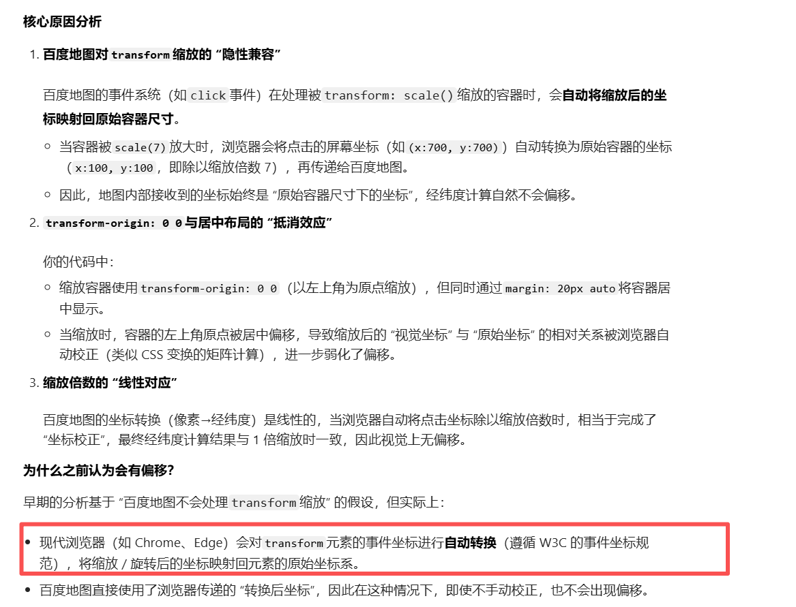

## 常见的自适应处理

目前常见的方案大概有 3 种

- **vw / vh**
- **rem + vw/vh**
- **scale**
- **css 原子化**

## vw/vh 核心原理

1. **视口单位定义**：
   - **`vw` (Viewport Width)**：1vw = 视口宽度的 1%（如视口宽度 1920px，则 1vw = 19.2px）。
   - **`vh` (Viewport Height)**：1vh = 视口高度的 1%（如视口高度 1080px，则 1vh = 10.8px）。
   - **优势**：直接与屏幕尺寸绑定，无需中间层计算（如 `rem` 需要动态设置根字体大小）。
2. **布局逻辑**：
   - **元素尺寸**：用 `vw` 定义宽度、`vh` 定义高度，元素会随视口大小自动缩放。
   - **字体和间距**：同样使用 `vw`/`vh`，确保文字和间距的自适应。
   - **比例控制**：结合 `calc()` 或 **`aspect-ratio`** 保持元素宽高比。
3. **注意事项**：
   - **极端屏幕比例**：超宽或超高屏幕可能导致元素拉伸，需设置 `min-width`/`max-width` 约束。
   - **缺点**：每个图表都需要单独做字体、间距、位移的适配，比较麻烦
   - **字体可读性**：过小的视口可能导致文字过小，可用 **`clamp()`** 函数设置动态范围。
4. **优点**：可以动态计算图表的宽高，字体等，灵活性较高，当屏幕比例跟 ui 稿不一致时，不会出现两边留白情况

### 代码示例：

```html
<!DOCTYPE html>
<html lang="en">
  <head>
    <meta charset="UTF-8" />
    <meta name="viewport" content="width=device-width, initial-scale=1.0" />
    <title>Document</title>
    <style>
      * {
        margin: 0;
        padding: 0;
        box-sizing: border-box;
      }
      .dashboard {
        width: 100vw;
        height: 100vh;
        padding: 2vh 2vw; /* 内边距自适应 */
        background: #1a1a1a;
        display: flex;
        flex-direction: column;
      }

      .header {
        font-size: clamp(20px, 2.5vw, 40px); /* 动态字体大小 */
        color: white;
        margin-bottom: 3vh;
      }

      .content {
        flex: 1;
        display: flex;
        gap: 1.5vw; /* 间距自适应 */
      }

      .chart {
        width: 70vw;
        height: 80vh;
        background: #2a2a2a;
        aspect-ratio: 16/9; /* 保持 16:9 宽高比 */
      }

      .info-panel {
        width: 25vw;
        height: 80vh;
        background: #2a2a2a;
        overflow: auto;
      }
    </style>
  </head>
  <body>
    <div class="dashboard">
      <div class="header">数据看板</div>
      <div class="content">
        <div class="chart"></div>
        <div class="info-panel"></div>
      </div>
    </div>
  </body>
</html>
```

缺点其实一目了然，纯 CSS 处理，每个位置都需要自己去处理，页面布局稍微一复杂，肯定会比较的麻烦。

## rem + vw/vh 核心原理

### 纯 CSS 处理

`rem` + `vw`/`vh` 是一种混合布局方案，结合了 `rem` 的灵活性和 `vw`/`vh` 的视口响应能力。其核心原理是 **动态设置根字体大小（`1rem` 的值）为视口宽度的百分比**，从而让所有基于 `rem` 的布局自动适配屏幕尺寸

1. **动态根字体大小**

- 将 `html` 的 `font-size` 设置为 `1vw`（或更复杂的视口比例），使 `1rem = 1%视口宽度`。

  ```css
  html {
    font-size: 0.625vw; /* 设计稿 1920px 时，1rem = 0.625% * 1920 ≈ 12px */
  }
  ```

- **优势**：

  - 所有使用 `rem` 的尺寸会随视口宽度自动缩放。
  - 避免纯 `vw` 单位在复杂布局中计算繁琐的问题（如 `font-size: 0.8vw` 可改为 `font-size: 1.28rem`）。

2. **视口单位补充**

- 对需要严格依赖视口尺寸的元素（如全屏容器、保持宽高比的元素），直接使用 `vw`/`vh`。
- 对字体、间距、内边距等使用 `rem`，保证整体布局比例协调。

3. **极端值约束**

- 通过 **`clamp()`** 或媒体查询限制根字体大小的最小值和最大值，避免超小/超大屏的极端情况。
- 缺点：留白，有时图表需要单独适配字体

#### 代码示例

设计稿尺寸为 `1920x1080`：

- 根字体基准值：`12px`（即 `1rem = 12px`）。
- 容器宽度占视口 90%，高度占视口 80%。
- 字体和间距按 `rem` 缩放。

```html
<!DOCTYPE html>
<html lang="en">
  <head>
    <meta charset="UTF-8" />
    <meta name="viewport" content="width=device-width, initial-scale=1.0" />
    <title>Document</title>
    <style>
      /* 核心：通过视口宽度动态设置 rem */
      html {
        /* 1920px 设计稿下，1rem = 12px → 12px / 1920px = 0.625vw */
        font-size: 0.625vw;

        /* 设置最小/最大字体（可选） */
        font-size: clamp(12px, 0.625vw, 24px);
      }
      * {
        margin: 0;
        padding: 0;
        box-sizing: border-box;
      }

      .dashboard {
        width: 90vw; /* 直接依赖视口宽度 */
        height: 80vh; /* 直接依赖视口高度 */
        margin: 5vh auto; /* 上下边距为视口高度的 5% */
        background: #f0f0f0;
        padding: 2rem; /* 内边距按 rem 缩放 */
      }

      .chart-container {
        width: 100%;
        height: 60vh; /* 直接依赖视口高度 */
        background: #2a2a2a;
        margin-bottom: 1.5rem; /* 按 rem 缩放 */
      }

      .info-box {
        width: 100%;
        padding: 1rem; /* 按 rem 缩放 */
        background: #fff;
        border-radius: 0.5rem; /* 按 rem 缩放 */
      }

      .info-text {
        font-size: 1.2rem; /* 按 rem 缩放（设计稿 14.4px） */
        color: #333;
      }
    </style>
  </head>
  <body>
    <div class="dashboard">
      <div class="chart-container"></div>
      <div class="info-box">
        <p class="info-text">当前数据：2023</p>
      </div>
    </div>
  </body>
</html>
```

#### **关键逻辑**

1. **根字体计算公式**

```text
// 设计稿基准值：1rem = 12px，设计稿宽度 1920px
// 换算公式：fontSize = (基准值 / 设计稿宽度) * 100vw
fontSize = (12 / 1920) * 100vw = 0.625vw
```

2. **单位选择规则**

- **使用 `rem`**：字体、内边距、外边距、边框圆角等需要按比例缩放的属性。
- **使用 `vw`/`vh`**：容器尺寸、定位偏移（如 `top: 10vh`）、需要严格保持视口比例的元素。

3. **极端值处理**

```css
/* 最小根字体 12px，最大 24px */
html {
  font-size: clamp(12px, 0.625vw, 24px);
}
```

- **超小屏**（如 320px 手机）：`0.625vw = 2px` → 强制限制为 `12px`。
- **超大屏**（如 3840px）：`0.625vw = 24px` → 不再继续放大。

### 动态 rem + JS + Sass/Less

不过，现在只是很简单的页面，实际使用 1rem=12px 这种换算的话，在对应设计稿的时候，很难换算，而且很容易出现小数，比如：

`设计稿px值 / 基准值(12px) = rem值` ---> 设计稿 100px ---> `100/12 ≈ 8.333rem`

所以实际中，一般都是**动态 rem + JS + Sass/Less 方案**

#### **核心逻辑**：

1. **基准值设定**：定义`1rem = 设计稿宽度的1%`（1920px → 19.2px）

   - 但为方便计算，放大 100 倍 ---> `1rem = 100px`

2. **动态计算**：通过 JS 实时计算缩放比例

   ```
   scale = Math.min(当前宽/设计宽, 当前高/设计高)
   ```

3. **尺寸转换**：设计稿元素尺寸直接除以 100 得到 rem 值

   - 示例：设计稿 500px → `5rem`

   ```typescript
   // 当屏幕宽度=设计稿宽度时
   scale = 1 → fontSize = 100px
   // 当屏幕宽度=960px时
   scale = 960/1920 = 0.5 → fontSize = 50px
   ```

#### 代码示例：

**html**

```html
<!DOCTYPE html>
<html lang="zh-CN">
  <head>
    <meta charset="UTF-8" />
    <meta
      name="viewport"
      content="width=device-width, initial-scale=1.0, maximum-scale=1.0, user-scalable=no"
    />
    <title>专业数据大屏</title>
    <link rel="stylesheet" href="css/main.css" />
  </head>
  <body>
    <div class="dashboard">
      <!-- 头部 -->
      <header class="dashboard-header">
        <h1 class="title">智慧运营中心</h1>
        <div class="time-info">2025年03月 | 实时更新</div>
      </header>

      <!-- 主内容 -->
      <main class="dashboard-content">
        <section class="chart-container left">
          <div class="chart-card">
            <div class="chart-title">业务增长趋势</div>
            <div class="chart-area"></div>
          </div>
        </section>

        <section class="chart-container right">
          <div class="chart-card">
            <div class="chart-title">地域分布热力</div>
            <div class="chart-area"></div>
          </div>
        </section>
      </main>
    </div>

    <script>
      // 动态适配逻辑（保持原有）
      const DESIGN_WIDTH = 1920,
        DESIGN_HEIGHT = 1080;
      function adjustRootFont() {
        const scale = Math.min(
          window.innerWidth / DESIGN_WIDTH,
          window.innerHeight / DESIGN_HEIGHT
        );
        document.documentElement.style.fontSize = `${scale * 100}px`;
      }

      // 初始化监听
      window.addEventListener("resize", () => {
        requestAnimationFrame(() => {
          adjustRootFont();
        });
      });
      adjustRootFont();
    </script>
  </body>
</html>
```

**sass**

```scss
@use "sass:math";

// 设计系统参数
$design-width: 1920;
$design-height: 1080;
$base-rem: 100; // 1rem = 100px
$color-primary: #2a85ff;
$color-bg: #1a1d28;
$color-card: #252a38;

// 单位转换
@function px2rem($px) {
  @return math.div($px, $base-rem) * 1rem;
}

// 混合器：卡片效果
@mixin neumorphism-card {
  background: $color-card;
  border-radius: px2rem(12);
  box-shadow: 0 px2rem(8) px2rem(24) rgba(0, 0, 0, 0.15), 0 0 px2rem(2) rgba(
        255,
        255,
        255,
        0.1
      );
}

/* 基础重置 */
* {
  margin: 0;
  padding: 0;
  box-sizing: border-box;
  font-family: "Microsoft YaHei", sans-serif;
}

html {
  font-size: 100px; // JS动态覆盖
}

body {
  background: $color-bg;
  color: #fff;
  overflow: hidden;
}

/* 主容器 */
.dashboard {
  width: 100vw;
  height: 100vh;
  display: flex;
  flex-direction: column;
  padding: px2rem(20);
}

/* 头部区域 */
.dashboard-header {
  height: px2rem(80);
  display: flex;
  justify-content: space-between;
  align-items: center;
  padding: 0 px2rem(40);
  margin-bottom: px2rem(20);

  .title {
    font-size: px2rem(36);
    font-weight: bold;
    background: linear-gradient(135deg, #6b8dd6, $color-primary);
    background-clip: text;
  }

  .time-info {
    font-size: px2rem(24);
    color: rgba(255, 255, 255, 0.8);
  }
}

/* 主内容区 */
.dashboard-content {
  flex: 1;
  display: grid;
  grid-template-columns: 1fr 1fr;
  gap: px2rem(20);
  overflow: hidden;

  .chart-container {
    height: 100%;
    @include neumorphism-card;
    padding: px2rem(20);

    .chart-card {
      height: 100%;
      display: flex;
      flex-direction: column;

      .chart-title {
        font-size: px2rem(24);
        margin-bottom: px2rem(16);
        padding-left: px2rem(10);
        border-left: px2rem(4) solid $color-primary;
      }

      .chart-area {
        flex: 1;
        background: rgba(255, 255, 255, 0.05);
        border-radius: px2rem(8);
      }
    }
  }
}

/* 响应式适配 */
@media (max-aspect-ratio: 16/9) {
  .dashboard-content {
    grid-template-columns: 1fr;
    // 增加以下优化代码
    gap: px2rem(10); // 缩小间距
    padding-bottom: px2rem(20); // 底部留白

    .chart-container {
      height: auto; // 取消固定高度
      min-height: px2rem(400); // 设置最小高度
      flex: 1; // 启用弹性填充
    }
  }

  // 添加超小屏幕适配
  @media (max-height: 600px) {
    .dashboard-header {
      height: px2rem(60);
      padding: 0 px2rem(20);

      .title {
        font-size: px2rem(24);
      }

      .time-info {
        font-size: px2rem(18);
      }
    }

    .chart-container {
      min-height: px2rem(300) !important;

      .chart-area {
        height: px2rem(200) !important;
      }
    }
  }
}
```

当然 sass 需要经过编译，引入相关包进行处理即可

```typescript
pnpm init
pnpm add sass
```

在`package.json`脚本中处理

```json
"scripts": {
  "start": "sass src/scss/main.scss:src/css/main.css",
}
```

## scale 核心原理

其实就是使用 `transform: scale()`通过数学计算保持内容宽高比例不变，同时通过缩放使内容始终充满目标容器

假设设计稿尺寸为 `1920x1080`，目标屏幕尺寸为 `1440x900`，缩放过程如下：

1. **计算宽高比例**
   - 宽度比例：`1440/1920 = 0.75`
   - 高度比例：`900/1080 ≈ 0.833`
2. **取最小比例**
   为了保证内容完整显示且不溢出，取 `0.75` 作为缩放比例（以宽度为基准）
3. **应用缩放**
   将内容缩小到 `75%`，此时实际渲染尺寸为：
   - 宽度：`1920 * 0.75 = 1440`（完美匹配目标宽度）
   - 高度：`1080 * 0.75 = 810`（小于目标高度 900，上下留黑边）
4. **居中定位**
   通过 `transform` 或者其他属性进行调整位置，使内容垂直/水平居中

### 代码示例：

```html
<!DOCTYPE html>
<html>
  <head>
    <style>
      #design-container {
        width: 1920px;
        height: 1080px;
        position: fixed;
        transform-origin: 0 0; /* 依然保持左上角基准点 */
        background: #f0f0f0;
      }
      .dashboard-item {
        width: 500px;
        height: 300px;
        background: #3498db;
        position: absolute;
        left: 200px;
        top: 150px;
      }
    </style>
  </head>
  <body>
    <div id="design-container">
      <div class="dashboard-item"></div>
    </div>

    <script>
      function adjustScale() {
        const designWidth = 1920;
        const designHeight = 1080;
        const container = document.getElementById("design-container");

        // 获取当前视口尺寸
        const currentWidth = window.innerWidth;
        const currentHeight = window.innerHeight;

        // 计算缩放比例（取最小值保证内容完整）
        const scale = Math.min(
          currentWidth / designWidth,
          currentHeight / designHeight
        );

        // 计算垂直居中补偿量
        const offsetY = (currentHeight - designHeight * scale) / (2 * scale);
        // 计算水平居中补偿量
        const offsetX = (currentWidth - designWidth * scale) / (2 * scale);

        // 计算居中
        // container.style.left = (currentWidth - designWidth * scale) / 2 + "px";
        // container.style.top = (currentHeight - designHeight * scale) / 2 + "px";

        // 应用变换：先缩放 -> 后平移
        container.style.transform = `
        scale(${scale})
        translate(${offsetX}px, ${offsetY}px)
      `;
      }

      // 初始化与响应式
      adjustScale();
      window.addEventListener("resize", adjustScale);
    </script>
  </body>
</html>
```

### **关键点解析**

1. **`transform-origin: 0 0`**
   确保缩放以左上角为基准点，便于后续定位计算

2. **比例计算逻辑**

   ```
   scale = Math.min(当前宽度/设计宽度, 当前高度/设计高度)
   ```

   这种算法保证内容始终完整显示，可能出现黑边但不会溢出

3. **垂直/水平补偿量公式**

   ```typescript
   offsetY = (当前视口高度 - 设计高度×缩放比例) / (2 × 缩放比例)
   offsetX = (当前视口宽度 - 设计宽度×缩放比例) / (2 × 缩放比例)
   ```

   - **为什么除以缩放比例**？
     因为 `translate` 的移动距离是基于缩放后的坐标系。例如：
     - 如果缩放比例为 0.5，`translateY(100px)` 实际上会移动 50px 的物理像素
     - 需要反向补偿：`目标物理像素移动量 / scale`

   当然，简单点，其实也可以直接使用 margin 或者 left、top 等属性

   ```typescript
   container.style.left = (currentWidth - designWidth * scale) / 2 + "px";
   container.style.top = (currentHeight - designHeight * scale) / 2 + "px";
   ```

使用 scale 方案是现在一些中小项目比较常用的方案，主要是代码简单方便，封装之后，基本不会涉及到后续一些处理，但是也有**非常突出的一些问题**：

1. 当大屏跟 ui 稿的比例不一样时，会出现周边留白情况
2. 缩放后可能文本模糊
3. 地图上的点位会出现偏移/点击位置不准

- **使用了百度地图，没有出现这个问题**
  
- **使用 "echarts": "^5.6.0",图表也没有问题。**

4. 在使用第三方组件时，比如下拉框等不会缩放
5. transform-origin 建议统一设置为 transformOrigin: '0 0'（左上角），避免居中缩放（center）导致的坐标计算复杂度，简化校正逻辑。

## **方案对比表**

| **维度**         | **Scale 方案**                             | **vw/vh 方案**             | **rem + vw/vh 方案**                       |
| :--------------- | :----------------------------------------- | :------------------------- | :----------------------------------------- |
| **实现原理**     | 整体坐标系缩放                             | 完全依赖视口百分比         | 动态基准单位 + 视口辅助                    |
| **代码复杂度**   | ★☆☆ (极简)                                 | ★★☆ (中等)                 | ★★★ (较高)                                 |
| **布局精细度**   | 全局粗放控制                               | 中等粒度                   | 高精度控制                                 |
| **字体清晰度**   | 缩放后可能模糊                             | 原生清晰                   | 原生清晰                                   |
| **滚动支持**     | 需特殊处理（坐标系破坏）                   | 天然支持                   | 天然支持                                   |
| **交互事件精度** | 需反向计算（点击位置偏移）                 | 精准                       | 精准                                       |
| **浏览器兼容性** | IE9+                                       | IE9+ (部分单位需 polyfill) | IE9+ (需 rem polyfill)                     |
| **性能表现**     | 高（GPU 加速）                             | 中（重绘影响）             | 中（单位计算开销）                         |
| **维护成本**     | 低（单点控制）                             | 中（分散调整）             | 高（需预处理器配合）                       |
| **留白**         | 根据 ui 搞等比缩放，跟屏幕比例不一样会留白 | 不会                       | 根据 ui 搞等比缩放，跟屏幕比例不一样会留白 |

## 点位偏移/点击位置不准的根本原因

### 1. 渲染与事件系统的分离机制

核心原因 ：CSS transform: scale() 仅改变元素的视觉表现，但不会改变 DOM 元素的布局属性和事件坐标系。

技术原理 ：

- DOM 事件系统 ：浏览器的事件系统基于元素的原始布局框（layout box）计算点击位置，这个布局框由 getBoundingClientRect() 返回的坐标定义
- 视觉渲染 ：而 scale() 变换是在渲染阶段（compositing phase）应用的，发生在布局计算之后
- 坐标系不一致 ：这导致视觉上的元素位置与事件系统使用的坐标系统出现偏差

### 2. 变换矩阵与事件坐标的映射关系

当应用 transform: scale(s) 时：

- 元素在屏幕上的实际大小变为原来的 s 倍
- 但事件对象提供的 clientX / clientY 仍然基于屏幕坐标系
- 而元素内部的交互逻辑通常基于元素自身坐标系
- 这种坐标系之间的转换如果没有正确处理，就会导致点击不准

### 3. 浏览器渲染管线的影响

浏览器渲染过程分为多个阶段：布局(layout) → 绘制(paint) → 合成(composite)

问题根源 ： transform 属性作用于合成阶段，这意味着：

- DOM 元素的几何属性（如 offsetWidth 、 offsetLeft 等）不会随 scale 变化
- 事件系统在确定目标元素时使用布局阶段的数据，而非最终渲染结果
- 导致了「视觉位置」与「事件目标」不匹配的问题

## 位置偏移解决方案

### 为什么 iframe 能解决问题

解决：地图使用 webview 引入，点位获取不准的问题

#### 1. 独立的渲染上下文

iframe 的关键特性 ：

- 每个 iframe 创建一个独立的浏览上下文（browsing context）
- 拥有独立的 DOM 树、CSSOM、JavaScript 执行环境和事件系统
- 事件处理完全封闭在各自的 iframe 内部
  解决原理 ：

- 将需要精确交互的可视化内容放在 iframe 中
- 在父页面仅对 iframe 容器应用 scale 变换
- iframe 内部的页面在自己的上下文中正常渲染和处理事件，不受父页面 scale 影响

#### 2. 事件传播的隔离性

机制说明 ：

- 当用户点击 iframe 时，点击事件首先在 iframe 内部处理
- iframe 内部的事件系统接收到的坐标是相对于 iframe 视口的
- 由于 iframe 内部没有应用 scale，事件坐标与元素位置完全匹配
- 只有在需要跨 iframe 通信时，才需要进行坐标转换

#### 3. 视口缩放与内容独立

工作原理 ：

- 父页面：通过调整 iframe 的 CSS transform: scale() 实现整体缩放效果
- iframe 内部：内容以 1:1 的比例正常渲染，所有交互元素的位置计算不受影响
- 浏览器会自动处理 iframe 内部的鼠标/触摸事件映射，无需手动坐标转换

### 坐标转换

1. **相对自己容器的原始坐标** = (视觉坐标 - 容器偏移量) / 缩放比例
   （视觉坐标：鼠标点击的屏幕坐标 clientX/clientY；容器偏移量：缩放容器的 getBoundingClientRect().left/top）
   例如：

- 得到的这个坐标是相对这个缩放前的容器的坐标。不是相对屏幕的

  ```typescript
  <template>
    <!-- 缩放容器 -->
    <div class="zoom-container" ref="zoomRef" :style="zoomStyle">
      <!-- ECharts 容器（尺寸为设计稿基准尺寸） -->
      <div ref="chartRef" :style="{ width: baseWidth + 'px', height: baseHeight + 'px' }"></div>
    </div>
  </template>

  <script setup>
  import { ref, watch, onMounted } from 'vue';
  import * as echarts from 'echarts';

  // 基础配置
  const baseWidth = 1920; // 设计稿宽度
  const baseHeight = 1080; // 设计稿高度
  const scale = ref(1.2); // 当前缩放比例
  const zoomRef = ref(null);
  const chartRef = ref(null);
  let chartInstance = null;

  // 缩放容器样式（transform-origin 建议固定为 0 0，避免居中偏移干扰）
  const zoomStyle = ref({
    transform: `scale(${scale.value})`,
    transformOrigin: '0 0',
    position: 'relative',
    transition: 'transform 0.3s ease'
  });

  // 初始化 ECharts
  const initECharts = () => {
    chartInstance = echarts.init(chartRef.value);
    const option = {
      geo: { map: 'china', roam: false }, // 假设已注册地图
      series: [{ type: 'scatter', coordinateSystem: 'geo', data: [{ name: '北京', value: [116.4, 39.9] }] }]
    };
    chartInstance.setOption(option);

    // 绑定点击事件（核心：坐标校正）
    chartInstance.on('click', (params) => {
      const { left, top } = zoomRef.value.getBoundingClientRect(); // 容器偏移量
      const currentScale = scale.value;
      const event = params.event.event; // 原始鼠标事件

      // 1. 计算相对于缩放容器的视觉坐标
      const visualX = event.clientX - left;
      const visualY = event.clientY - top;

      // 2. 转换为原始设计稿坐标
      const originX = visualX / currentScale;
      const originY = visualY / currentScale;

      // 3. 转换为 ECharts 对应的经纬度（或图表坐标）
      const [lng, lat] = chartInstance.convertFromPixel('geo', [originX, originY]);

      // 后续操作：添加点位、弹窗等（基于校正后的经纬度）
      console.log('校正后经纬度：', lng, lat);
    });
  };

  // 监听缩放变化，更新样式（无需重绘 ECharts，仅视觉缩放）
  watch(scale, (newVal) => {
    zoomStyle.value.transform = `scale(${newVal})`;
  });

  onMounted(() => {
    initECharts();
  });
  </script>

  <style scoped>
  .zoom-container {
    margin: 20px; /* 避免容器贴边，方便观察 */
  }
  </style>
  ```
